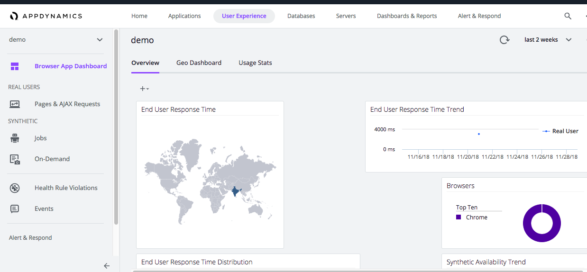
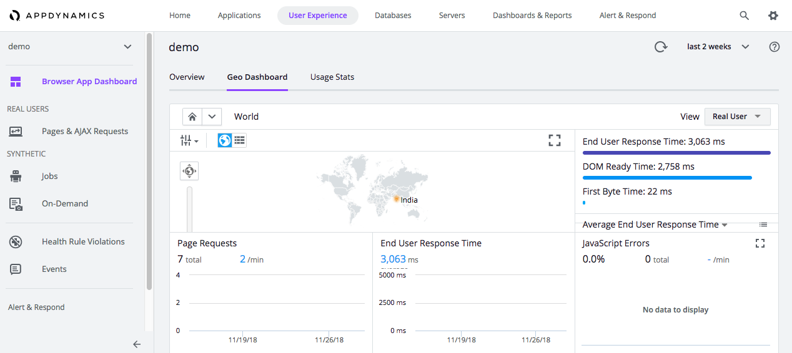
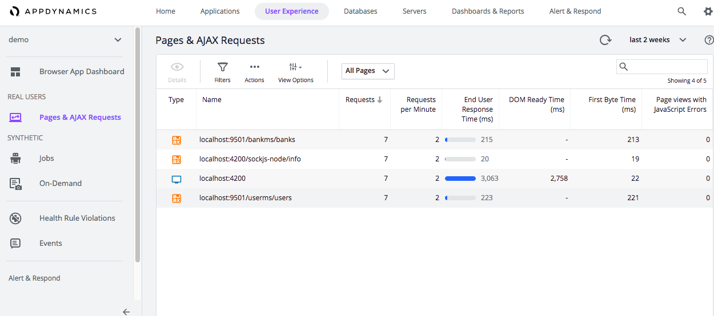

### End user metrics using AppDynamics(EUM)


[EUM Server Deployment](https://docs.appdynamics.com/display/PRO45/EUM+Server+Deployment)

[SPA2 Monitoring](https://docs.appdynamics.com/display/PRO45/SPA2+Monitoring)

[Setup Access Browser RUM](https://docs.appdynamics.com/display/PRO44/Set+Up+and+Access+Browser+RUM)

```
  window['adrum-start-time'] = new Date().getTime();
    window["adrum-app-key"] = 'XX-XX-XX';
    
    (function(config){
        config.appKey = 'XX-XX-XX';
        config.adrumExtUrlHttp = 'http://cdn.appdynamics.com';
         config.adrumExtUrlHttps = 'https://cdn.appdynamics.com';
         config.beaconUrlHttp = 'http://col.eum-appdynamics.com';
         config.beaconUrlHttps = 'https://col.eum-appdynamics.com';
         config.xd = {enable : false};
     })(window['adrum-config'] || (window['adrum-config'] = {}));


```






